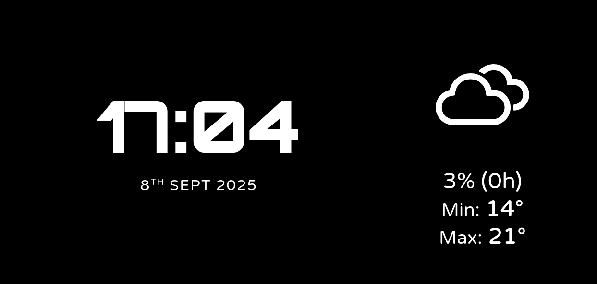

# Weather Clock

A minimalist clock face for landscape phone screens which displays the weather.

Live version: <https://mccormick.cx/apps/clock>

## Usage

- **Toggle Fullscreen**: Tap the screen to enter or exit fullscreen mode.
- **Open Settings**: Long-press the screen (for about 1 second) to open the settings menu.
- **Set Location Manually**: In the settings, you can type in your desired latitude and longitude.
- **Use Geolocation**: Click "Use Current Location" to have the browser find your current position.
- **Save Settings**: Click "Save & Close" to apply your location settings. The location will be saved in your browser for your next visit.
